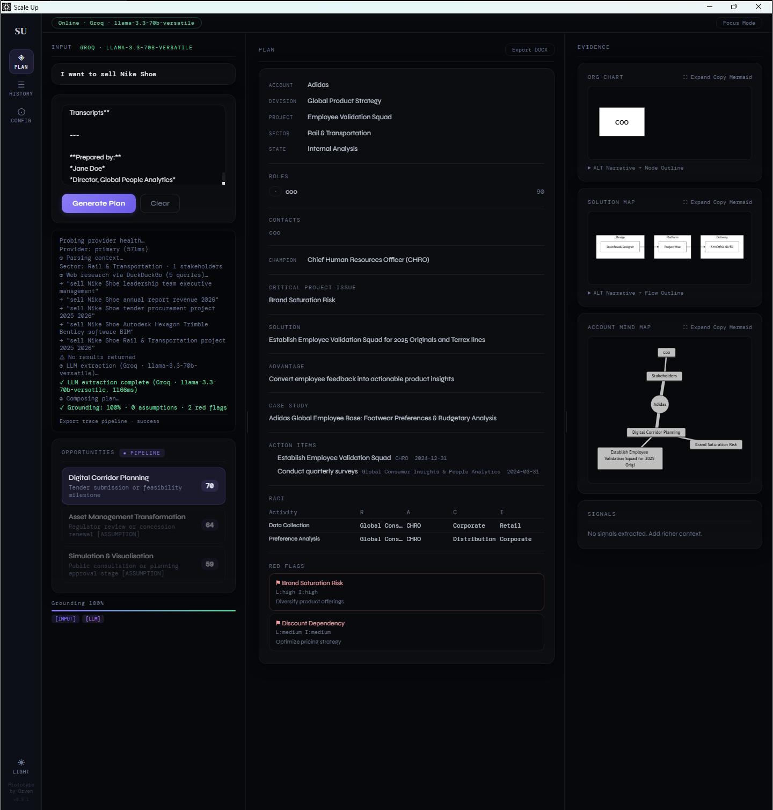

# Scale Up (Alpha)

Scale Up is a Windows desktop application that helps turn scattered account notes into a clearer strategy plan.

It is intended for technical sales, account planning, and opportunity review work. You provide the intent and the source material. The app helps organize that information into a structured output you can review, refine, and export.
---

---

## What it is for

Use Scale Up to:

* turn messy notes into a usable account plan
* prepare for meetings, reviews, and follow-ups
* organize stakeholders, actions, risks, and opportunities
* create a structured draft faster
* export the result to DOCX

This is a planning tool. It does not replace judgment, internal review, or approval workflows.

---

## Current version

* **App:** Scale Up
* **Version:** 0.9.0
* **Platform:** Windows x64
* **Installer:** `Scale Up_0.9.0_x64_en-US.msi`
* **Advanced/dev package:** `scale_up_windows_deploy_pack_v14.zip`

---

## Install

### Standard install

1. Download `Scale Up_0.9.0_x64_en-US.msi`
2. Run the installer
3. Launch **Scale Up** from the Start menu or desktop shortcut

### If you are uploading this repository with the MSI included

Place the MSI where users can find it easily, for example:

* in the repository root, or
* in GitHub Releases

If you also include `scale_up_windows_deploy_pack_v14.zip`, make it clear that it is for advanced users or development/build use, not required for normal app usage.

---

## Prerequisites

### Required

* **Windows 10 or Windows 11**
* **Microsoft Edge WebView2 Runtime**

Scale Up uses WebView2 for its desktop interface. Many Windows systems already have this installed. If the app does not open after installation, check WebView2 first.

---

## Optional prerequisites

These depend on how you want to use the app.

### Basic use

No API key is required.

The app can still be used in a simpler deterministic mode.

### Cloud AI use

You may need:

* internet access
* a valid API key
* a correct endpoint
* a supported model name

### Local AI fallback

You may need:

* Ollama installed
* Ollama running locally
* a local model already available

Typical local endpoint:

`http://localhost:11434`

### Web research

Web research can run with DuckDuckGo fallback.

For stronger results, you can optionally add a **Serper.dev API key** in Settings.

### Knowledge base

The local knowledge base does not usually need extra software, but you will need a local folder of relevant files to sync and index.

---

## First-time setup after MSI install

Before using the app for real work, check the following:

* the app launches successfully
* WebView2 is available
* a short sample input can generate a plan
* DOCX export works
* if using AI, your provider settings are correct
* if using Ollama, the local endpoint responds
* if using the knowledge base, sync completes successfully

---

## How to use

### 1. Open the app

Launch Scale Up from the Start menu or desktop shortcut.

### 2. Enter your intent

In the **Intent** field, describe what you want the plan to achieve.

Example:

`Build an account strategy for a software opportunity at Company A`

Clear and specific intent usually gives better results.

### 3. Add your source material

Paste text into the main input area, or drag and drop supported files.

Useful source material includes:

* meeting notes
* emails
* CRM extracts
* internal summaries
* project notes
* customer research

### 4. Generate the plan

Click **Generate Plan**.

Depending on your setup, the app may use:

* deterministic logic
* optional AI assistance
* optional local Ollama fallback
* optional web research
* optional local knowledge base context

### 5. Review the result

Read the generated output carefully before using it. Check names, roles, assumptions, actions, and risks.

### 6. Export

Use **Export DOCX** to save the plan into a shareable document.

You can also export the last trace for diagnostics.

---

## Supported input types

Scale Up currently works with:

* `.txt`
* `.md`
* `.csv`
* `.json`
* `.xlsx`
* `.xls`
* `.docx`

### PDF note

PDF text extraction is not currently supported as a normal direct workflow.

If your source is a PDF, copy the text into the app or convert it to DOCX or TXT first.

---

## What the output can include

A generated plan may include:

* account
* division
* project
* sector
* state of account
* champion
* roles and contacts
* critical project issue
* solution
* advantage
* action items
* projects
* RACI
* assumptions
* red flags
* opportunities

---

## Settings

Depending on your setup, Settings may allow you to manage:

* API key
* endpoint
* model
* local Ollama fallback
* web research key
* prompt overrides
* knowledge base folder

If you are not using cloud AI, you do not need to fill in every setting.

---

## Knowledge base

Scale Up includes an optional local knowledge base.

You can sync local files into a keyword index. During plan generation, the app only pulls relevant matching content from that index.

Useful sources include:

* internal account notes
* product positioning material
* account history
* sector guidance
* reusable planning references

Recommended practice:

* keep the folder focused
* avoid unrelated files
* re-sync when the contents change

---

## Troubleshooting

### The app does not open after installation

Check:

* you are on Windows 10 or 11
* WebView2 Runtime is installed
* installation completed successfully
* restart Windows once and try again

### The app opens but Generate Plan does nothing

Check:

* the input area is not empty
* the intent is clear
* the file type is supported
* your AI settings are valid if AI is enabled
* Ollama is running if you are using local fallback

Also try a small sample input first.

### AI connection does not work

Check:

* API key
* endpoint
* model name
* internet access
* firewall or proxy restrictions

Common causes:

* invalid key
* wrong endpoint
* unsupported model
* blocked network access

### Ollama fallback does not work

Check:

* Ollama is installed
* Ollama is running
* the configured endpoint is correct
* the selected model exists locally

Typical endpoint:

`http://localhost:11434`

### Web research is weak or unavailable

DuckDuckGo fallback may still work, but quality can vary.

For stronger results:

* add a Serper.dev API key in Settings
* confirm internet access is allowed
* retry generation

### DOCX export fails

Try:

* exporting again
* saving to a normal local folder
* reopening the app
* testing with a smaller input

If plan generation works but DOCX export fails, the issue is likely in the export step.

### Drag and drop does not work

Check:

* the file type is supported
* the file is not open in another application
* the file is not corrupted
* the file is not a PDF being treated like a supported text source

### The output looks weak or incomplete

Usually this means the input needs improvement.

Try:

* giving a clearer intent
* using more direct and recent notes
* removing duplicates or conflicting notes
* separating unrelated accounts into different runs
* reviewing assumptions before export

---

## Best practices

* use one account or opportunity per run
* keep the intent specific
* provide recent and relevant notes
* avoid mixing unrelated source material
* review every generated section before sharing
* treat the output as a working draft, not final truth

---

## Privacy and usage notes

Scale Up can run in different modes depending on your configuration.

* deterministic mode may avoid external AI services
* local AI mode may use your local Ollama endpoint
* cloud AI mode may send content to the configured provider
* web research mode may access public internet sources

Use the mode that matches your environment and data handling requirements.

---

## For advanced users

This repository may also include:

* `Scale Up_0.9.0_x64_en-US.msi`
* `scale_up_windows_deploy_pack_v14.zip`

Use the **MSI** for normal installation.

Use the **deploy pack zip** only if you are reviewing, rebuilding, or working on the application package itself.

---

## Summary

Scale Up is a Windows tool for turning raw notes into a more structured account strategy plan.

It works best when:

* the intent is clear
* the input is relevant
* the prerequisites are in place
* the output is reviewed by a human
* optional AI and research features are used carefully
